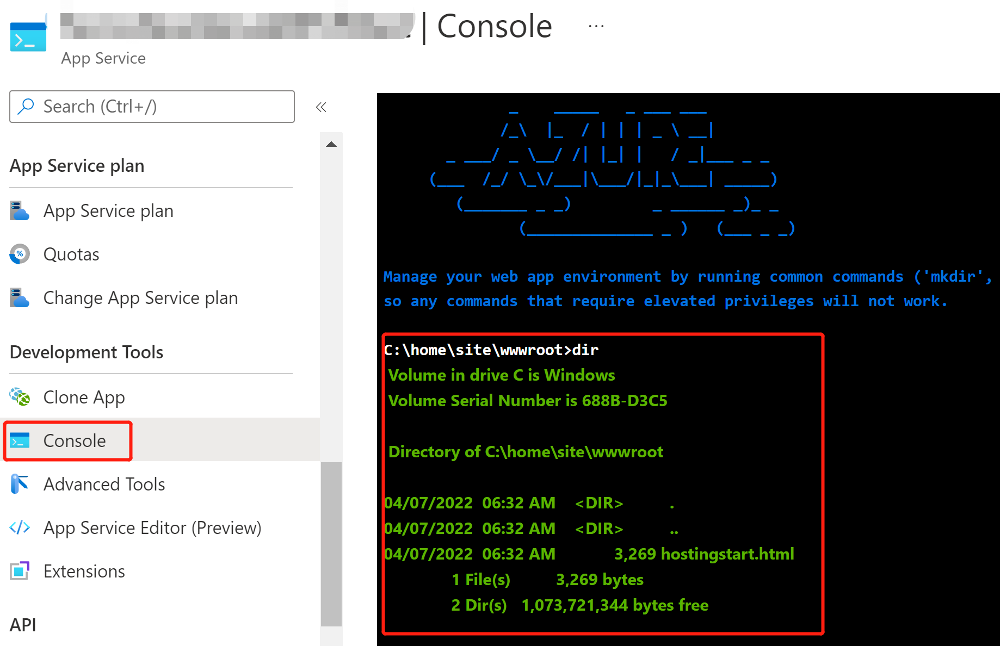
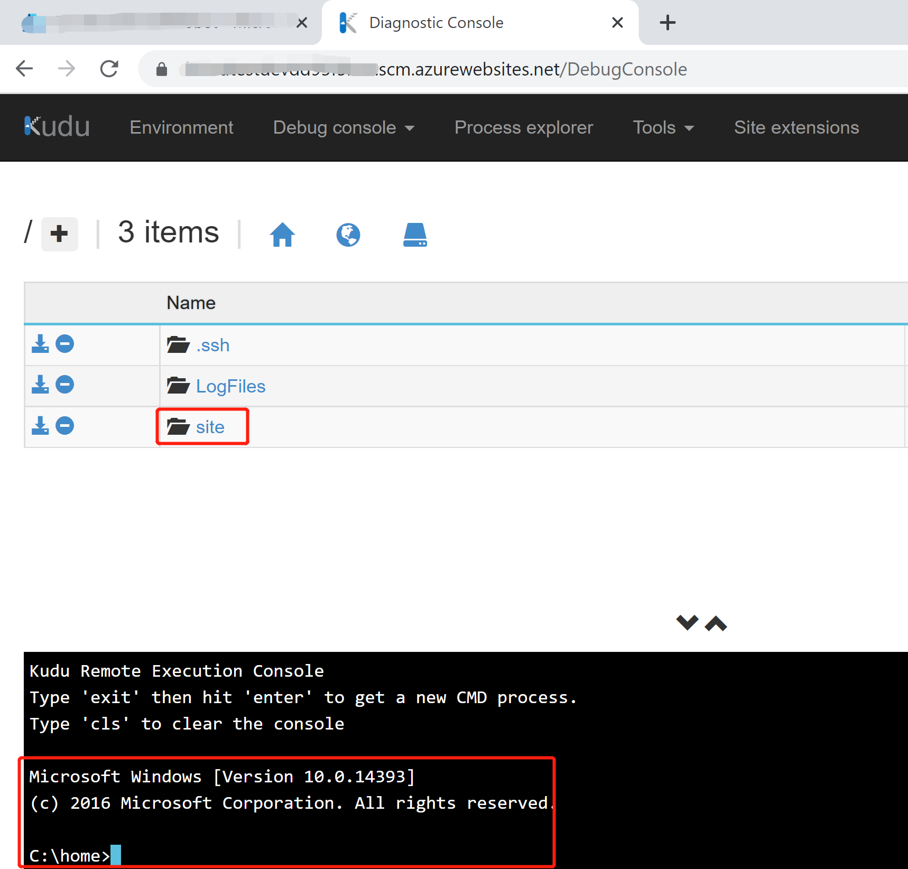
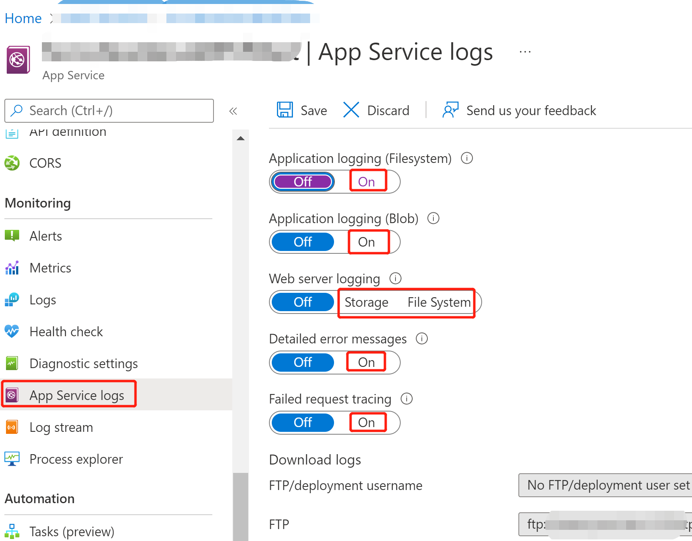
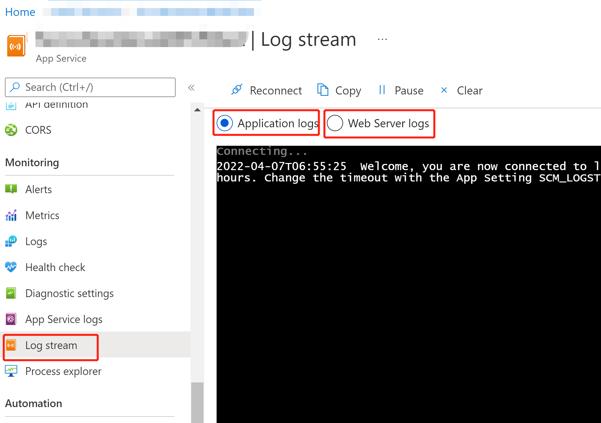

## BT.MissingSubscriptionRegistrationError

### Error Message

The subscription didn't register to use namespace 'Microsoft.BotService'.

### Mitigation

Please refer to this [link](https://aka.ms/rps-not-found) to register your subscription to use namespace 'Microsoft.BotService'.

## BT.BotRegistrationNotFoundError

### Error Message

### Mitigation


## How to reuse existing AAD in Toolkit v2?

Suppose an existing AAD has been registered, you can reuse this AAD by configuring Toolkit project settings.

### Register an AAD on Azure Portal
1. Manually create a new App Registration on [Azure Portal](https://ms.portal.azure.com/), note down the **Application (client) ID** on the "overview" page.
2. Create a client secret for the AAD created in step 1, note down the **client secret**.


3. Fill in the appid and secret in `${ProjectFolder}/.fx/configs/config.${env}.json`, add the `bot` section, and the settings will look like:
```
  "manifest": {
        "appName": {
            "short": "xxxx",
            "full": "Full name for xxxx"
        }
    },
    "bot": {
        "appId": "${Application (client) ID}",
        "appPassword": "${client secret}"
    }
```
4. Provision the Bot, then it will reuse this AAD and won't create a new one.

## How can I troubleshoot issues when Teams Bot isn't responding on Azure?
 
For general troubleshooting guidance, please refer to [Bot Framework Troubleshooting Index](https://docs.microsoft.com/en-us/azure/bot-service/bot-service-troubleshoot-index?view=azure-bot-service-4).

When Teams Bot isn't responding, you probably want to check its status on Azure. There're two fundamental points you'd better check first:
### 1. Is the Teams Bot deployed successfully? Is the Teams Bot up and running? Is the basic communication good?
1. Log into Azure by [portal](https://portal.azure.com/) and find your Azure Bot's app service.
1. Check if the deployment artifacts are existing under the folder of `wwwroot` by Console in control panel:

or the scm website `<yourwebsite>.scm.azurewebsites.net/DebugConsole`:

1. If you also host some static pages with the Bot, you can try to access the target urls to see if they're available. 
### 2. Is there anything wrong in the server log or application log?
1. As above, you have to log into Azure first.
1. Turn on app service logs.

1. Click `Log stream`, then try to send some messages to the Teams Bot.
1. Try to see if there any logs streamed out after a short delay.

1. Hopefully, you may find some insights about the reason why the Teams Bot isn't responding.
