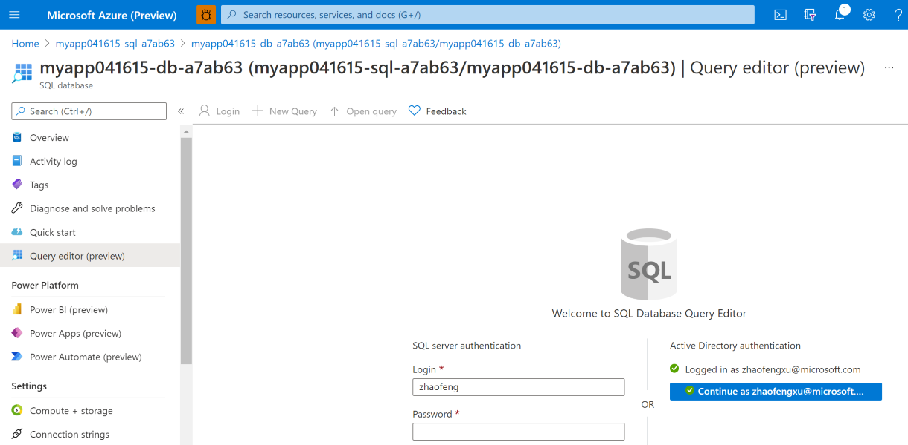
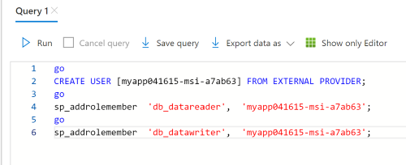

## SQL.DatabaseUserCreateError

### Error Message

`database` create `user` failed. 

### Mitigation

#### Step #1 add skip flag
1. Open `.fx\configs\config.{envName}.json` file.
1. Add a key named 'skipAddingSqlUser', and set the value to true.
1. Run `TeamsFx - Provision in the cloud` command again.

#### Step #2 add database user manually

To make sure the identity user can access to database correctly, you should add database user manually.
Since the current logged in account hasn't enough permission to add database user, you may get a user account have enough permission to access to database. 
1.  Open `.fx\states\state.{envName}.json` file.
1. Find values of 'sqlEndpoint', 'databaseName' config of 'fx-resource-azure-sql' and value of 'identityName' config of 'fx-resource-identity'.

      

1. Provision aad admin in SQL Database. You can follow [set aad admin](https://docs.microsoft.com/en-us/azure/azure-sql/database/authentication-aad-configure?tabs=azure-powershell#provision-azure-ad-admin-sql-database) to set aad admin for the {sqlEndpoint}. Usually you can use the **account logged-in Azure** as aad admin.

1. Login the SQL server from portal and select database to login.

      

1. Create contained database users. Execute Transact-SQL. 

   ```
   CREATE USER [{identityName}] FROM EXTERNAL PROVIDER;
   go
   sp_addrolemember  'db_datareader',  '{identityName}';
   go
   sp_addrolemember  'db_datawriter',  '{identityName}';
   go
   ```

      
1. (Optional) If there are multiple databases added in the project, you can find all databases besides the default one from `databaseName_{suffix}` config `.fx\states\state.{envName}.json`. Add database user for them using the same steps mentioned above.

## SQL.SqlAccessError

### Error Message

Failed to access `sql server`.

### Mitigation

#### Manage IP firewall rules
1. Open `.fx\states\state.{envName}.json` file. Find values of 'sqlEndpoint' config of 'fx-resource-azure-sql'.

      

1. Refer to [ Manage IP firewall rules](https://docs.microsoft.com/en-us/azure/azure-sql/database/firewall-configure#from-the-database-overview-page) to add local firewall rule for the 'sqlEndpoint' in step 1