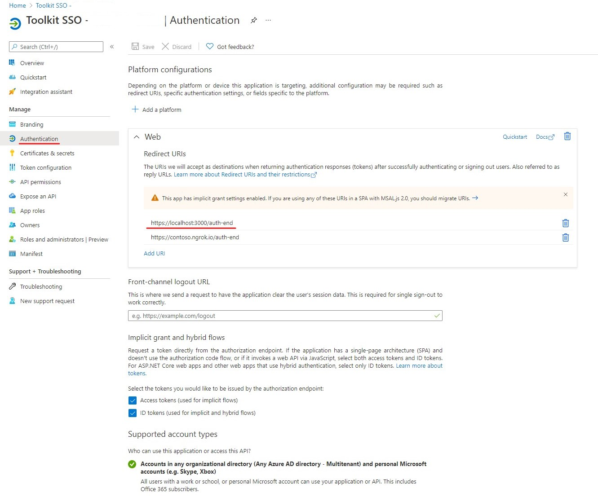
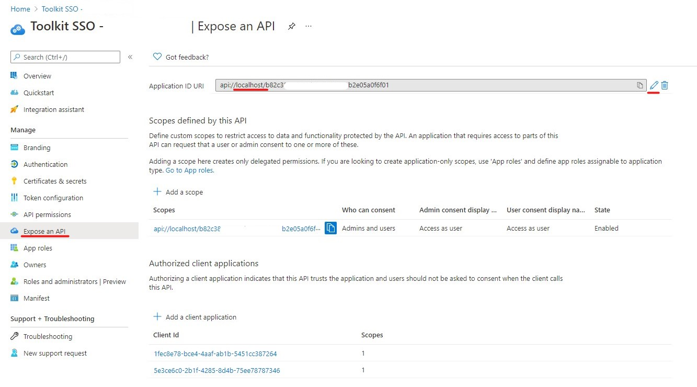

# Build UI-based Apps for Teams
Microsoft Teams supports the ability to run web-based UI inside "custom tabs" that users can install either for just themselves (personal tabs) or within a team or group chat context.

## Prerequisites
- [NodeJS](https://nodejs.org/en/)
- An M365 account. If you do not have M365 account, apply one from [M365 developer program](https://developer.microsoft.com/en-us/microsoft-365/dev-program)
- [Teams Toolkit Visual Studio Code Extension](https://aka.ms/teams-toolkit) 

##  Initialize V1 tab project with the latest Teams Toolkit
- From Visual Studio Code, open command palette and select `Teams: Initialize your project to work with the latest Teams Toolkit`
- Choose the `Custom tab` capability from the prompts

## Debug
Start debugging the project by hitting the `F5` key in Visual Studio Code. Alternatively use the `Run and Debug Activity Panel` in Visual Studio Code and click the `Start Debugging` green arrow button. A new teams app will be created for local debug.

**Note**: If your project is a tab app with SSO, you should manually start the auth service. Under `tabs/api-server`, execute 
```
npm install
npm start
```

## Manual configuration steps for Tab + SSO (Single sign-on) project
If your project is a tab app with SSO, there are some manual steps to enable debug after migration.

You should replace all the ngrok domain in the project to `localhost` because the debug in the latest Teams Toolkit do not need to use ngrok any more.

The following are the steps of how to manually configure a default tab app.

### Update AAD application
1.	Go to your application in the [AAD portal](https://azure.microsoft.com/en-us/features/azure-portal/) and find your application.
2.	Under **Manage**, select **Authentication**.
3.	Change the redirect URI domain to `localhost:3000`. 
		E.g. `https://contoso.ngrok.io/auth-end` to `https://localhost:3000/auth-end`
		
4.	Under **Manage**, select **Expose an API**.
5.	Edit the **Application ID URI**, change the domain to `localhost`.
		E.g. `api://contoso.ngrok.io/{app-id}` to `api://localhost/{app-id}`
		
 
### Edit manifest
Edit manifest template `appPackage/manifest.source.json`. Update the property `webApplicationInfo.resource` to the latest Application ID URI `api://localhost/{app-id}`.
### Edit environment variables
Edit the environment configuration file `tabs/.env`. Update the value of `REACT_APP_BASE_URL` to `https://localhost:3000`.


## Edit the manifest
You can find the Teams manifest in `.fx/manifest.source.json`. It contains template arguments with `{...}` statements which will be replaced at build time. You may add any extra properties or permissions you require to this file. See the [schema reference](https://docs.microsoft.com/en-us/microsoftteams/platform/resources/schema/manifest-schema) for more.
