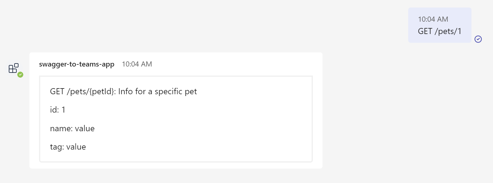
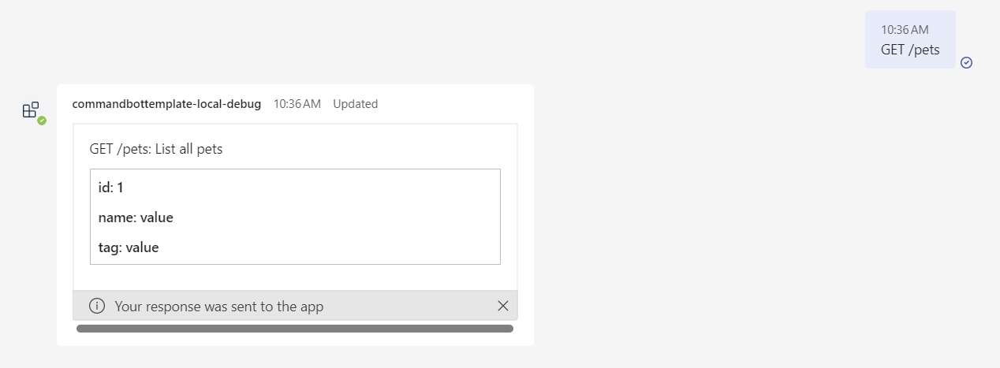
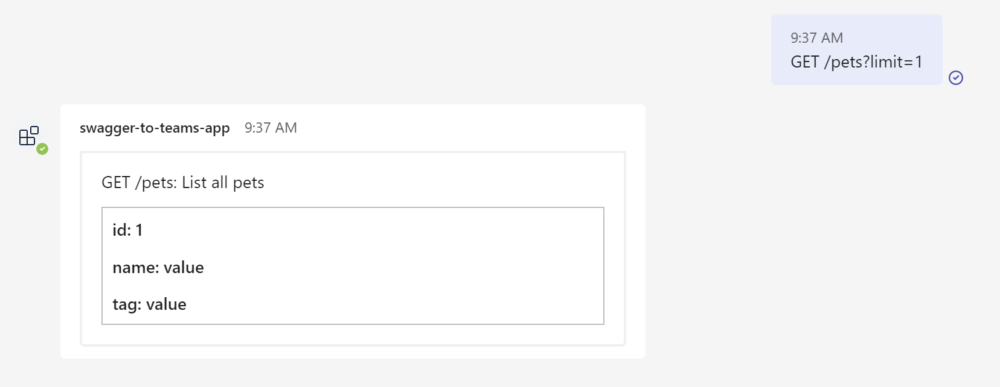

# Introduction
This is a CLI tool to convert OpenAPI spec file to Teams App command bot project with adaptive cards based on [TeamsFx](https://github.com/OfficeDev/TeamsFx).

# Prerequisite
To run this CLI and run generated Teams APP in your local dev machine or deploy to Azure, you will need:

- [Node.js](https://nodejs.org/), supported versions: 14, 16, 18
- An [Microsoft 365 account for development](https://docs.microsoft.com/microsoftteams/platform/toolkit/accounts)
- [Teams Toolkit Visual Studio Code Extension](https://aka.ms/teams-toolkit) version 5.0.0 and higher or [TeamsFx CLI](https://aka.ms/teamsfx-cli)
- [Option] If you want to deploy this APP to Azure, you also need an Azure subscription. If you don't have an Azure subscription, [create a free account](https://azure.microsoft.com/en-us/free/) before you begin

# Quick Start

- Install the CLI
  ```
  npm install @microsoft/api2teams@latest -g
  ```

- Clone and download sample swagger yaml files
  ```
  git clone https://github.com/SLdragon/test-swagger-yaml-files
  ```

- Go to `test-swagger-yaml-files` folder, and run the command below to convert `test4.yml` file to Teams App, it will generate teams project to `generated-teams-app` folder
  ```
  cd test-swagger-yaml-files
  api2teams test4.yml
  ```

- You can specify which folder to generate teams project as below
  ```
  api2teams test4.yml -o my-custom-teams-app-folder
  ```

- If you want to overwrite the output folder, you can use `-f` paramters
  ```
  api2teams test4.yml -o my-custom-teams-app-folder -f
  ```

- If you have other personal swagger yaml files, you can also use this CLI tool to covert them.

# CLI Usage

The CLI name is `api2teams`. Usage is as below:

```
Usage: api2teams [options] <yaml>

Convert open api spec file to Teams APP project, only for GET operation

Arguments:
  yaml                   yaml file path to convert

Options:
  -o, --output [string]  output folder for teams app (default: "./generated-teams-app")
  -f, --force            force overwrite the output folder
  -v, --version          output the current version
  -h, --help             display help for command
```

User can input below command to generate Teams App to default or specific folder:

```bash
api2teams test.yml # generate teams app to default folder ./generated-teams-app
api2teams test.yml -o ./my-app # generate teams app to ./my-app folder
api2teams test.yml -o ./my-app -f # generate teams app to ./my-app folder, and force overwrite output folder
api2teams -h # show help message
api2teams -v # show version information
```

# Run Generated Teams App

- Open generated folder in VSCode, and make sure you have installed [Teams Toolkit >= 5.0.0](https://marketplace.visualstudio.com/items?itemName=TeamsDevApp.ms-teams-vscode-extension).

- Click F5 in VSCode to run the Teams App to view the result (Below is the example of teams app converted by [test4.yml](./tests/e2e/swagger-files/test4.yml) file)

  - Send message `GET /pets/1` to Bot, bot will send a response adaptive card:

    

  - Send message `GET /pets` to Bot, it will first send request a request adaptive card:

    

  - Input value in the request adaptive card, and then click GET button, it will send back response adaptive card:

    

  - Send message `GET /pets?limit=1`, it will send back response adaptive card directly:

    
    
# Current Limitations
1. Only OpenAPI version 3.0.0 or higher is supported.
1. Authorization properties inside OpenAPI spec is not supported
1. Only GET operations are supported.
1. The webhooks property is not supported and will be ignored during conversion.
1. The oneOf, anyOf, and not keywords are not supported, not because there is no better way to represent them in adaptive cards. Only the allOf keyword is supported.
1. For request cards, there is no proper element to represent array types in adaptive cards, so users need to input array values manually.
1. Adaptive cards do not support file uploads, so if an API contains file uploads, it cannot be converted to adaptive card.
1. Due to Teams limitations, command intellisense can only contain a maximum of 10 items.

# References
- [Teams Toolkit extension](https://learn.microsoft.com/en-us/microsoftteams/platform/toolkit/teams-toolkit-fundamentals)
- [Adaptive card official site](https://adaptivecards.io/)
- [Adaptive card designer](https://adaptivecards.io/designer)
- [Swagger Parser](https://github.com/APIDevTools/swagger-parser)
- [Swagger Samples](https://github.com/OAI/OpenAPI-Specification)