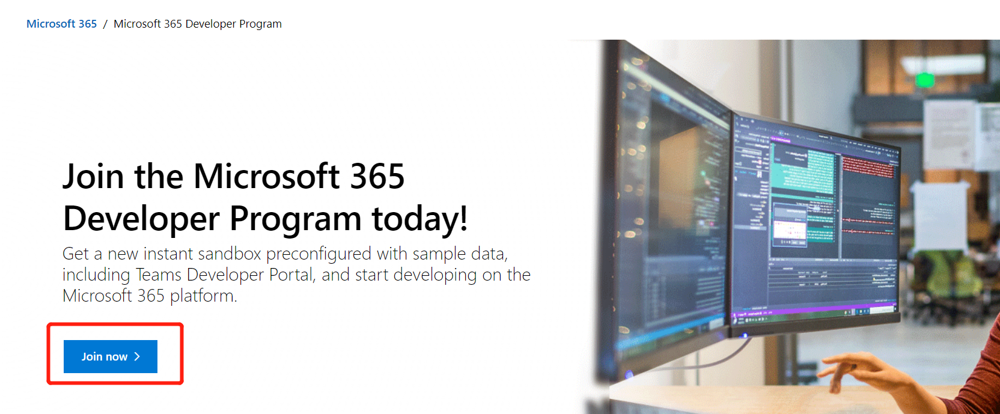

# How to create a free Microsoft 365 test tenant?

Microsoft 365 test tenant is to get you an instant sandbox of Microsoft 365 developer environment. Instead of making you provison all your Microsoft 365 apps and install your data packs one by one, it contains pre-installed sample data packs so you can quickly work on this tenant.

## Prequisitives

- A personal Microsoft account, or a work or school account.

## Steps to create instant sandbox

- Sign In [Microsoft 365 Dev program](https://developer.microsoft.com/en-us/microsoft-365/dev-program) with your personal Microsoft account or your work or school account.

If you don't have a personal Microsoft account, or a work or school account. You can click `Create one` to create an account.

>Note: Please do not Sign in Microsoft 365 Dev program with a *.onmicrosoft.com account. Otherwise, you will meet the following error in the next step.

- Click `Join now`, this will navigate you to instant sandbox creation page.

- (Optional) If you already have a normal subscription before, you can click `Start` button on dashboard page to setup an instant sandbox.

- Answer some questions to customize your Developer Program experience

- Setup your Microsoft 365 E5 sandbox

- You may need to add a phone number for security verification.

## Now you have an instant sandbox.

>Note: You can use the newly created *.onmicorosoft.com accounts to log in to Teams Toolkit for VS Code. The custom app upload permission has already been configured.

## (Optional) Check whether uploading custom apps option is on

- Sign in to [Teams Admin Center](https://admin.teams.microsoft.com) with your admin credentials.

- Navigate to `Teams apps > Setup Policies > Global`.

- Check whether `Upload custom apps` is `On`.

- Select `Save`.
