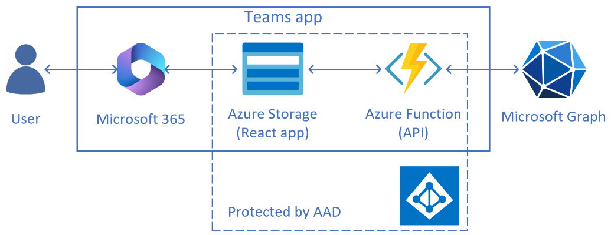
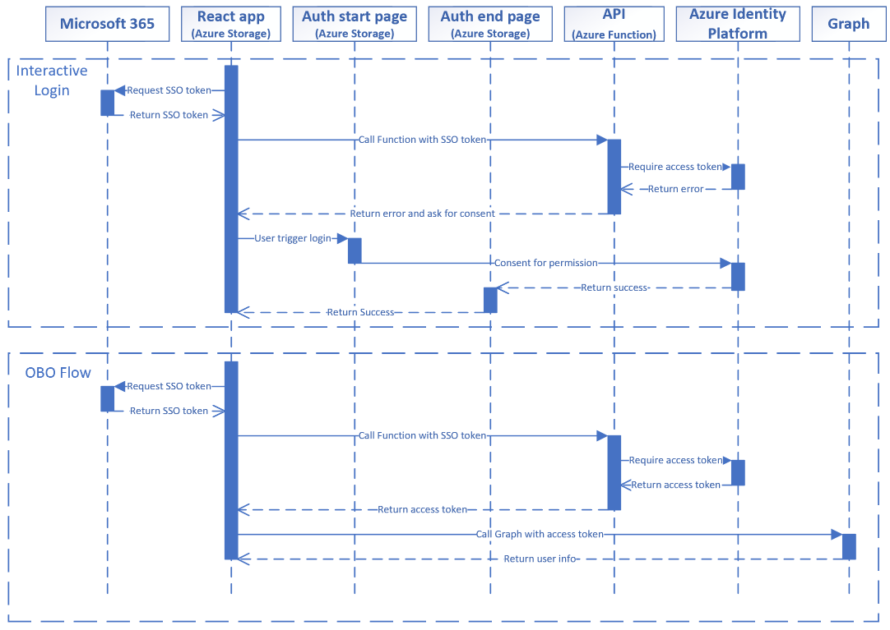

# Overview of the React with Fluent UI template

This app showcases how to craft a visually appealing web page that can be embedded in Microsoft Teams, Outlook and the Microsoft 365 app with React and Fluent UI. The app also enhances the end-user experiences with built-in single sign-on and data from Microsoft Graph.

## Architecture

This app has the following main components:

1. Azure Storage: Host the React app with Fluent UI. Code of the React app can be found in `src` folder.
    
2. Azure Function: Middle-tier service to call Graph. Adopted [On-Behalf-Of flow](https://learn.microsoft.com/en-us/azure/active-directory/develop/v2-oauth2-on-behalf-of-flow). Code of the Azure Function can be found in `api` folder.

3. Azure Active Directory: Both `Azure Storage` and `Azure Function` are configured with Azure Active Directory(AAD) app and using the AAD app for authentication.

## Authentication

For scenario that user has not consent for permissions, app will run `Interactive Login` flow to ask user for consent. Once consented, app will run `OBO flow` to call Graph to get user's profile.

Some key points in the authentication flow:
1. Get SSO token and call Azure Function with SSO token

    This app uses `TeamsFx` SDK to get SSO token from Microsoft 365 apps. Related code can be found in `src\components\samples\AzureFunction.ts`.
2. Get access token with SSO token

    This app uses `createMicrosoftGraphClientWithCredential` to create a graph client and will automatically request for access token with provided SSO token. Related code can be found in `api\index.ts`.

## Get started with the React with Fluent UI template

> **Prerequisites**
>
> To run the command bot template in your local dev machine, you will need:
>
> - [Node.js](https://nodejs.org/), supported versions: 16, 18
> - A [Microsoft 365 account for development](https://docs.microsoft.com/microsoftteams/platform/toolkit/accounts)
> - [Set up your dev environment for extending Teams apps across Microsoft 365](https://aka.ms/teamsfx-m365-apps-prerequisites)
> Please note that after you enrolled your developer tenant in Office 365 Target Release, it may take couple days for the enrollment to take effect.
> - [Teams Toolkit Visual Studio Code Extension](https://aka.ms/teams-toolkit) version 5.0.0 and higher or [Teams Toolkit CLI](https://aka.ms/teamsfx-cli)

1. First, select the Teams Toolkit icon on the left in the VS Code toolbar.
2. In the Account section, sign in with your [Microsoft 365 account](https://docs.microsoft.com/microsoftteams/platform/toolkit/accounts) if you haven't already.
3. Press F5 to start debugging which launches your app in Teams using a web browser. Select `Debug (Edge)` or `Debug (Chrome)`.
4. When Teams launches in the browser, select the Add button in the dialog to install your app to Teams.

**Congratulations**! You are running an application that can now show a beautiful web page in Teams, Outlook and the Microsoft 365 app.

## What's included in the template

| Folder       | Contents                                            |
| - | - |
| `.vscode`    | VSCode files for debugging                          |
| `appPackage` | Templates for the Teams application manifest        |
| `env`        | Environment files                                   |
| `infra`      | Templates for provisioning Azure resources          |
| `src`        | The source code for the Teams application |

The following are Teams Toolkit specific project files. You can [visit a complete guide on Github](https://github.com/OfficeDev/TeamsFx/wiki/Teams-Toolkit-Visual-Studio-Code-v5-Guide#overview) to understand how Teams Toolkit works.

| File                                 | Contents                                           |
| - | - |
|`teamsapp.yml`|This is the main Teams Toolkit project file. The project file defines two primary things:  Properties and configuration Stage definitions.|
|`teamsapp.local.yml`|This overrides `teamsapp.yml` with actions that enable local execution and debugging.|
|`aad.manifest.json`|This file defines the configuration of Azure Active Directory app. This template will only provision [single tenant](https://learn.microsoft.com/azure/active-directory/develop/single-and-multi-tenant-apps#who-can-sign-in-to-your-app) Azure Active Directory app.|

## Extend the React with Fluent UI template

Following documentation will help you to extend the React with Fluent UI template.

- [Add or manage the environment](https://learn.microsoft.com/microsoftteams/platform/toolkit/teamsfx-multi-env)
- [Create multi-capability app](https://learn.microsoft.com/microsoftteams/platform/toolkit/add-capability)
- [Use an existing Azure Active Directory application](https://learn.microsoft.com/microsoftteams/platform/toolkit/use-existing-aad-app)
- [Customize the Teams app manifest](https://learn.microsoft.com/microsoftteams/platform/toolkit/teamsfx-preview-and-customize-app-manifest)
- Host your app in Azure by [provision cloud resources](https://learn.microsoft.com/microsoftteams/platform/toolkit/provision) and [deploy the code to cloud](https://learn.microsoft.com/microsoftteams/platform/toolkit/deploy)
- [Collaborate on app development](https://learn.microsoft.com/microsoftteams/platform/toolkit/teamsfx-collaboration)
- [Set up the CI/CD pipeline](https://learn.microsoft.com/microsoftteams/platform/toolkit/use-cicd-template)
- [Publish the app to your organization or the Microsoft Teams app store](https://learn.microsoft.com/microsoftteams/platform/toolkit/publish)
- [Enable the app for multi-tenant](https://github.com/OfficeDev/TeamsFx/wiki/Multi-tenancy-Support-for-Azure-AD-app)
- [Preview the app on mobile clients](https://github.com/OfficeDev/TeamsFx/wiki/Run-and-debug-your-Teams-application-on-iOS-or-Android-client)
